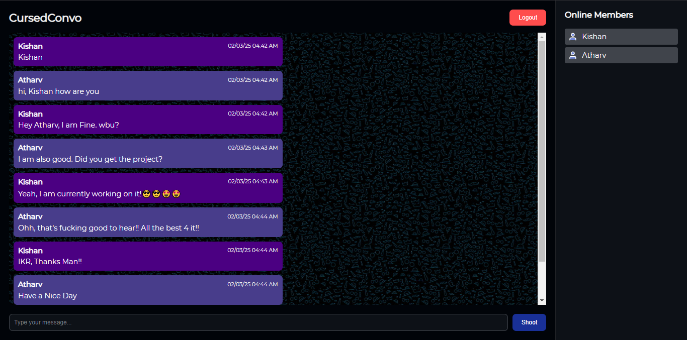
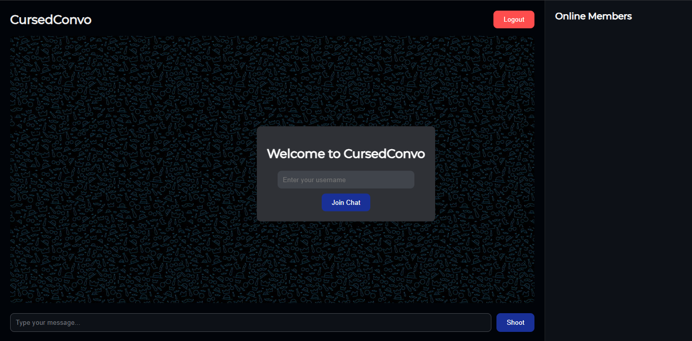

# **CursedConvo: A Real-Time Chat Application**

Welcome to **CursedConvo**, a real-time chat application built with **Django**, **Django Channels**, and **WebSockets**. This project allows multiple users to join a chat room, send messages in real-time, and view a list of online members.

---

## **Features**

- **Real-Time Chat:** Send and receive messages instantly using WebSockets.
- **Online Members List:** View a real-time list of users currently online.
- **Username Validation:** Prevent duplicate usernames from joining the chat.
- **Dark Theme:** A clean and modern dark theme with a responsive design for Phones too.
- **Message Timestamps:** Each message includes the date and time it was sent.
- **Multicolored Bubble:** For clear distinction between users, different color is assigned.
- **Emoji Support:** All types of Emoji are supported into the Chat Text.

---

## **Tech Stack**

- **Backend:** Django, Django Channels, Python
- **Frontend:** HTML, CSS, JavaScript
- **WebSocket Protocol:** Real-time bidirectional communication(Django ASGI)
- **Deployment:** Daphne (ASGI server)

---

## **Getting Started**

### **Step 1: Clone the Repository**

Clone the repository to your local machine:

```bash
git clone https://github.com/Atharv-A2/CursedConvo.git
cd CursedConvo
```

---

### **Step 2: Set Up the Virtual Environment**

Create and activate a virtual environment:

```bash
python -m venv .venv
source .venv/bin/activate  # On Windows: .venv\Scripts\activate
```

---

### **Step 3: Install Dependencies**

Install the required Python packages:

```bash
pip install -r requirements.txt
```

---

### **Step 5: Configure the Application**

1. Verify the `CHANNEL_LAYERS` setting in `settings.py` to use InMemory Channel:

   ```python
   CHANNEL_LAYERS = {
      "default": {
         "BACKEND": "channels.layers.InMemoryChannelLayer",
      },
   }
   ```

2. Apply database migrations:
   ```bash
   python manage.py migrate
   ```

---

### **Step 6: Run the Application**

Start the Django development server with Daphne:

```bash
daphne CursedConvo.asgi:application
```

---

### **Step 7: Access the Application**

Open your browser and navigate to:

```
http://127.0.0.1:8000/chat/
```

---

## **How It Works**

### **1. Join the Chat**

- Enter a unique username to join the chat.
- If the username is already taken, you'll be prompted to choose a different one.

### **2. Send Multiple and Consequent Messages**

- Type your message in the input box and press **Enter** or click **Send**.
- Your message will be broadcast to all users in the chat room.

### **3. View Online Members**

- The list of online members is displayed in the right-hand panel.
- The list updates in real-time as users join or leave the chat.

---

## **Project Structure**

```
CursedConvo/
├── ChatIt/                      # Django app for chat functionality
│   ├── consumers.py           # WebSocket consumers
│   ├── routing.py             # WebSocket routing
│   ├── templates/             # HTML templates
│   └── views.py               # Django views
├── CursedConvo/               # Django project settings
│   ├── asgi.py                # ASGI configuration
│   ├── settings.py            # Django settings
│   └── urls.py                # URL routing
├── requirements.txt           # Python dependencies
├── screenshots                # Screenshots attached
└── README.md                  # Project documentation
```

---

## **Screenshots**

1. **Chat Room:**
   

2. **Username Popup:**
   

---

## **Future Enhancements**

- **Message Persistence:** Store chat history in a database.
- **Private Messaging:** Allow users to send private messages to each other.
- **User Roles:** Implement roles like admin, moderator, and user.
- **Kick-out Feature:** Malicious User can be Kicked out by the Admin or Moderator.

---

## **Contributing**

Contributions are welcome! If you'd like to contribute, please follow these steps:

1. Fork the repository.
2. Create a new branch (`git checkout -b feature/YourFeatureName`).
3. Commit your changes (`git commit -m 'Add some feature'`).
4. Push to the branch (`git push origin feature/YourFeatureName`).
5. Open a pull request.

---

## **License**

This project is licensed under the MIT License. See the [LICENSE](LICENSE) file for details.

---

## **Acknowledgments**

- **Django Channels:** For enabling WebSocket support in Django.
- **WebSockets:** For providing a Channel for Asynchronous Monitoring and management.
- **Daphne:** For serving the ASGI application.

---

Together I make a platform to go to Hell through those CursedConvos! 🚀🔥☠
